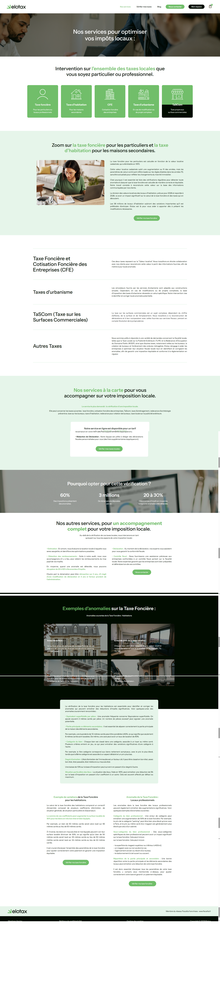

# 🌐 Site vitrine - Client : Elotax

> Projet réalisé pour un client dans le cadre d'une prestation freelance.

Ce dépôt documente un site vitrine professionnel conçu entièrement avec **WordPress** et **Elementor**.  
Il met en avant les services de [nom du client / activité], avec un design personnalisé, responsive et optimisé.

🔗 [Voir la version en ligne](https://elotax.fr/)

---

## 📌 Détails du projet

- **Client** : Elotax
- **Type de projet** : Site vitrine multi pages
- **Objectif** : Présenter les services, générer des prises de contact, inspirer confiance
- **CMS** : WordPress
- **Page Builder** : Elementor
- **Thème utilisé** : [Hello Elementor / Astra / autre]
- **Durée de réalisation** : 1 mois
- **Date de mise en ligne** : mars 2023e

---

## 📁 Pages principales

- Accueil
- Services
- Vérifier ma taxe
- Blog
- Contact (formulaire)

---

## 🧩 Fonctionnalités

- Design sur mesure avec Elementor
- Site responsive (mobile / tablette)
- Formulaire de contact
- Intégration de Google Maps
- Optimisation SEO de base (balises, structure HTML, etc.)
- Performances : cache, images optimisées

---

## 🖼️ Captures d’écran

| Accueil | Services | Contact |
|--------|----------|---------|
|  |  |  |

---

## 🚧 Déploiement & Hébergement

- Hébergement : IONOS SARL, 7 place de la Gare, BP 70109 57201 Sarreguemines Cedex (www.ionos.fr)
- Domaine : www.elotax.fr
- Sécurité : HTTPS via SSL, plugins de sécurité de base

---

## 👤 Réalisé par

**Martial Mertzig - Welinkton**  
Développeur / intégrateur WordPress  
[tonportfolio.com](https://martial-mertzig-portfolio.fr/)
[LinkedIn](https://www.linkedin.com/in/martialmertzig/) – [GitHub](https://github.com/martialmertzig)

---

## 📎 Remarques

> Ce dépôt ne contient pas le code source du site (WordPress).  
> Il documente uniquement le projet pour présentation dans un portfolio.  
> Les fichiers sources (template Elementor, export WP) sont disponibles sur demande, sous conditions.